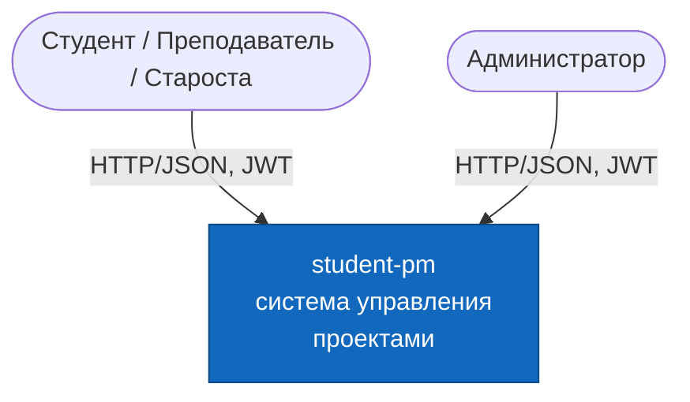
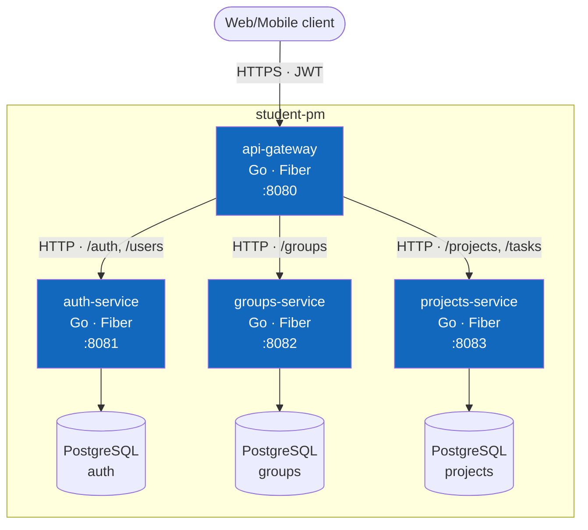
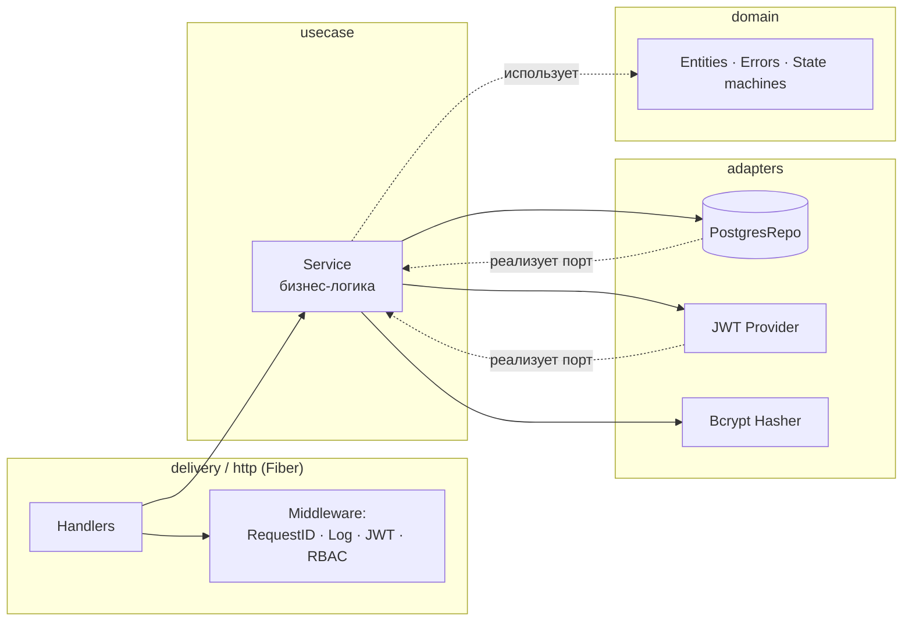
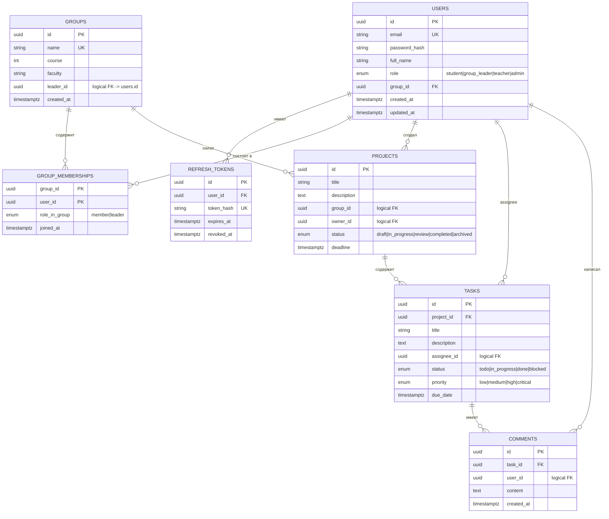
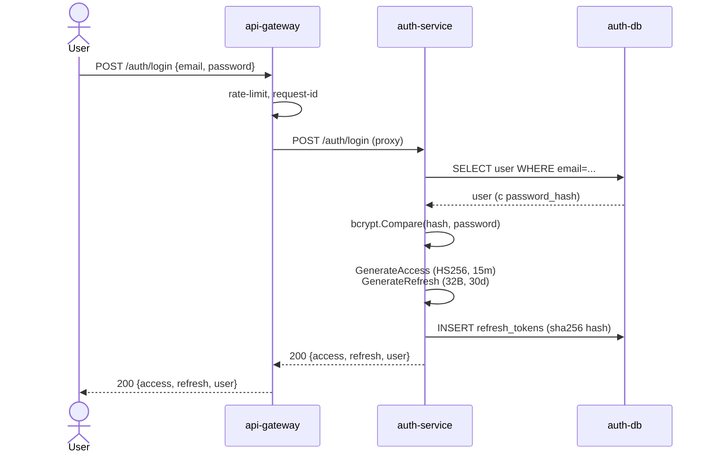
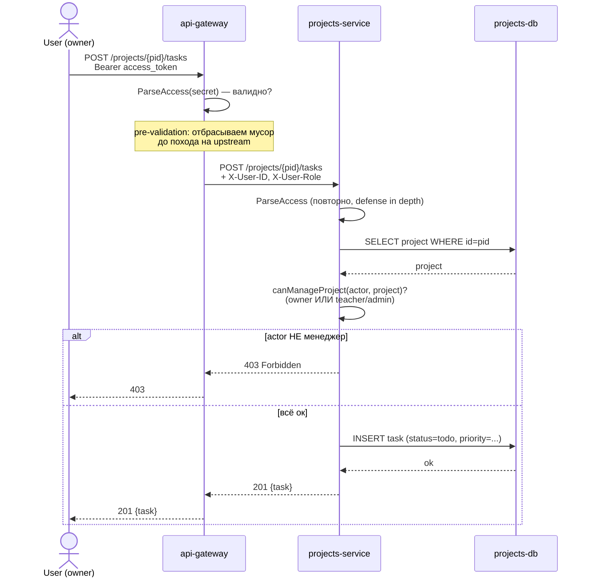
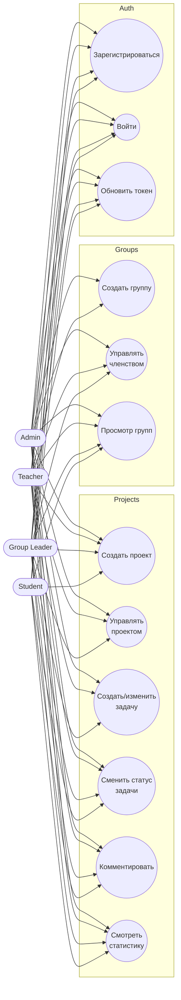

# student-pm

**Система управления проектами для студенческих групп.** Курсовая работа: микросервисная архитектура на Go, Clean Architecture, PostgreSQL, JWT, Docker.

---

## Оглавление

1. [Что внутри](#что-внутри)
2. [Быстрый старт](#быстрый-старт)
3. [Архитектура](#архитектура)
   - [C4: Context](#c4-context)
   - [C4: Container](#c4-container)
   - [Внутреннее устройство сервиса](#внутреннее-устройство-сервиса-clean-architecture)
4. [ER-диаграмма](#er-диаграмма)
5. [Sequence-диаграммы](#sequence-диаграммы)
6. [Use case-диаграмма](#use-case-диаграмма)
7. [Структура репозитория](#структура-репозитория)
8. [Пояснительная записка](#пояснительная-записка)
   - [Почему Clean Architecture](#почему-clean-architecture)
   - [Почему микросервисы, а не монолит](#почему-микросервисы-а-не-монолит)
   - [Разграничение bounded contexts (DDD)](#разграничение-bounded-contexts-ddd)
   - [Почему REST везде, а не gRPC между сервисами](#почему-rest-везде-а-не-grpc-между-сервисами)
9. [Тестирование](#тестирование)
10. [Дальнейшее развитие](#дальнейшее-развитие)

---

## Что внутри

Четыре сервиса, каждый — отдельный Go-модуль, отдельная БД, отдельный Docker-образ:

| Сервис             | Порт   | БД-порт | Назначение                                                        |
| ------------------ | ------ | ------- | ----------------------------------------------------------------- |
| `api-gateway`      | 8080   | —       | Единая точка входа: маршрутизация, JWT pre-validation, rate limit |
| `auth-service`     | 8081   | 5433    | Регистрация, логин, JWT, пользователи                             |
| `groups-service`   | 8082   | 5434    | Студенческие группы и членство                                    |
| `projects-service` | 8083   | 5435    | Проекты, задачи, комментарии, статистика                          |

Технологии: Go 1.22+, Fiber v2, PostgreSQL 15, pgx/v5, golang-migrate, golang-jwt, zerolog, viper, go-playground/validator, swaggo/swag.

---

## Быстрый старт

```bash
git clone <repo-url> && cd student-pm
cp .env.example .env                                   # один JWT_SECRET для всех

docker-compose up -d --build                           # поднимает 3 БД + 4 сервиса
make smoke                                             # проверка: все health-чеки 'ok'
```

**Swagger UI** (агрегатор всех трёх spec-файлов): <http://localhost:8080/swagger/>
**Postman**: импортировать `postman/collection.json`. Сценарий «register → login → create group → create project → create task → comment → stats» работает по умолчанию.

### Локальный режим (для отладки в VS Code)

```bash
make up-db                                             # только БД
# открыть проект в VS Code, F5 → "All services"
```

`launch.json` уже содержит конфигурации с `POSTGRES_HOST=localhost` и портами, замапленными на хост.

### Остановить и удалить

```bash
make down                       # остановить
make down-volumes               # ОПАСНО: удалить тома БД
```

---

## Архитектура

### C4: Context



Пользователи: **студент**, **староста группы**, **преподаватель**, **администратор**. Все взаимодействуют с системой через единый REST API на `8080`.

### C4: Container



**Database per Service.** Каждый сервис владеет своей БД и не имеет прямого доступа к чужим. Связи между сущностями (`projects.group_id`, `groups.leader_id`, `tasks.assignee_id`) — **логические FK**: ссылка по UUID, без `REFERENCES` на уровне БД.

### Внутреннее устройство сервиса (Clean Architecture)



Зависимости направлены **строго внутрь**: `delivery` и `repository` зависят от `usecase`, `usecase` — от `domain`, `domain` — ни от чего. Порты (интерфейсы репозиториев и адаптеров) объявлены в `usecase/interfaces.go`, реализованы в `repository/` и `pkg/{jwt,hasher}`.

Внешние библиотеки (`fiber`, `pgx`, `bcrypt`, `golang-jwt`) живут только во внешних слоях. Замена `pgx` на `gorm` или `Fiber` на `chi` потребует изменений только в адаптере соответствующего слоя.

---

## ER-диаграмма



**Жёсткие FK** — только внутри одной БД (`tasks.project_id`, `comments.task_id`, `refresh_tokens.user_id`).
**Логические FK** — между БД разных сервисов: только UUID-ссылка, без `REFERENCES`.

---

## Sequence-диаграммы

### Логин



Refresh-токен хранится в БД как `sha256` хэш — даже компрометация дампа БД не выдаст токены.

### Создание задачи (через gateway, RBAC, IDOR-защита)



JWT проверяется дважды: на gateway (быстрая отбраковка) и на сервисе (источник истины для Actor). RBAC живёт в usecase сервиса — gateway не знает про owner проекта.

---

## Use case-диаграмма



Подробная RBAC-матрица — в README каждого сервиса.

---

## Структура репозитория

```
student-pm/
├── api-gateway/              # точка входа :8080 — proxy + JWT pre-validation
├── auth-service/             # :8081 — register/login/refresh/users
├── groups-service/           # :8082 — CRUD групп + членство
├── projects-service/         # :8083 — projects/tasks/comments/stats
│
├── docker-compose.yml        # 3 БД + 4 сервиса, healthchecks, общая сеть
├── Makefile                  # умеет «всё разом» (см. make help)
├── .env.example              # JWT_SECRET для compose
├── .vscode/
│   ├── launch.json           # F5 для каждого сервиса + compound «All services»
│   └── settings.json         # Go-настройки workspace
├── postman/
│   └── collection.json       # все эндпоинты, токен auto-saves
├── docs/                     # дополнительные материалы (можно класть .puml/.png)
└── README.md                 # этот файл
```

Каждый сервис изнутри:

```
<service>/
├── cmd/main.go               # DI, миграции, graceful shutdown
├── internal/
│   ├── domain/               # Entities + Errors (без зависимостей)
│   ├── usecase/              # Use Cases + порты репо/адаптеров
│   ├── repository/           # adapters (pgx/v5)
│   ├── delivery/http/        # handlers, middleware, routes, DTO + Swagger
│   ├── config/               # viper + godotenv
│   └── pkg/{jwt,hasher,errors,validator,logger}
├── migrations/               # golang-migrate
├── tests/{unit,integration}/
├── docs/                     # swag init выход
├── Dockerfile · Makefile · .air.toml · .env.example
└── README.md
```

---

## Пояснительная записка

### Почему Clean Architecture

В курсовой важна не «писать код, чтобы работал», а **показать понимание границ** между бизнес-логикой и инфраструктурой. Clean Architecture даёт это явно:

1. **Доменные сущности** (`domain/`) знают только себя. `Project`, `Task`, `User` — это структуры с инвариантами (например, `TaskStatus.CanTransitionTo()` — state-machine целиком в домене). Они компилируются без `database/sql`, без `fiber`, без `bcrypt`.
2. **Use cases** (`usecase/`) знают, **что** должна делать система — но не **как**. Регистрация, выдача токенов, RBAC-проверки. Зависят только от портов (интерфейсов).
3. **Адаптеры** (`repository/`, `pkg/jwt`, `pkg/hasher`) реализуют порты. Postgres, JWT, bcrypt — здесь.
4. **Транспорт** (`delivery/http/`) — мостик между HTTP-протоколом и use case'ами. DTO, middleware, маппинг ошибок.

**Что это даёт на практике:**
- RBAC-правила тестируются без HTTP, БД и токенов — `tests/unit/service_test.go` каждого сервиса показывает это: `usecase.NewService(mockRepo, ...)` и поехали.
- State-machine статусов задач — отдельный файл `transitions_test.go` без единого мока, чистая доменная логика.
- При замене `pgx` на `gorm` придётся править только `repository/postgres.go`. При замене `fiber` на `gin` — только `delivery/http/`.

### Почему микросервисы, а не монолит

Технически для курсовой задачи на 4 сущности подошёл бы и монолит — это было бы быстрее. Но **выбор оправдан педагогически**: микросервисная архитектура заставляет принимать архитектурные решения, которые в монолите можно отложить:

1. **Database per Service** — нельзя дёрнуть `JOIN` через границу контекста. Это вынуждает явно проектировать межсервисное взаимодействие. Пример: `groups.leader_id` хранит UUID пользователя, но `JOIN`'a с таблицей `users` (она в другой БД) нет. На приложение нагружается работа: вернуть массив group'ов, потом для отображения подгрузить пользователей из auth-service.
2. **Bounded contexts** становятся материальны. В монолите легко случайно превратить `User.GroupID` в гордиев узел — пакет `users` начинает зависеть от пакета `groups`, потом обратно. В микросервисах это просто **физически** невозможно.
3. **Отказоустойчивость**. Падение `groups-service` не валит `auth-service` (логин продолжает работать). В монолите — один panic = всё упало.
4. **Разработка независимыми командами** — это не курсовая задача, но архитектура к ней готова.

**Цена**: больше boilerplate, дублирование (`Role` enum в каждом сервисе), более сложный деплой. Для курсовой это — фича: показывает понимание trade-off'ов.

### Разграничение bounded contexts (DDD)

Границы намечены по управляющим моделям данных:

| Контекст     | Корневой агрегат      | Дочерние сущности                   | Источник правды для    |
| ------------ | --------------------- | ----------------------------------- | ---------------------- |
| **Auth**     | `User`                | `RefreshToken`                      | identity, JWT          |
| **Groups**   | `Group`               | `Membership`                        | состав групп, лидерство |
| **Projects** | `Project` (агрегат-корень) | `Task`, `Comment`              | задачи, статусы, статистика |

Что важно:

- **`User` существует только в Auth.** `groups-service` хранит `leader_id` как UUID — он не знает имени, email'а, роли. Если нужно показать «лидер Иван Иванов» в UI — клиент сам делает второй запрос в `/users/{id}`. Это не bug, это явная граница.
- **Никаких событий между сервисами.** Пока. Когда понадобится «при удалении пользователя — удалить его memberships» — туда зайдёт RabbitMQ/NATS и появится `notifications-service`. Сейчас удаление пользователя оставит «висящие» memberships — это явная цена на упрощении и оговорена в README сервисов.
- **`Project` — корневой агрегат, `Task` и `Comment` живут в его контексте.** Поэтому в `projects-service` они в одном пакете usecase, в одной БД — это правильное разделение по DDD.

Перенос сущностей между сервисами **возможен**, но требует миграции данных + перерисовки маршрутов в gateway. На этапе курсовой это сделано один раз и зафиксировано.

### Почему REST везде, а не gRPC между сервисами

В ТЗ дана альтернатива (gRPC между сервисами или REST везде) и предложено обосновать. **Я выбрал REST везде**:

1. **Сейчас межсервисных вызовов нет.** Сервисы общаются только через клиента (через gateway). Это правильно для bounded context'ов — никакой `groups → projects` синхронной цепочки. JWT_SECRET — единственная общая «штука», и она через `.env`.
2. **gRPC давал бы ценность только при сценарии**: «`projects-service` хочет проверить, что `assignee_id` — участник группы проекта». Я этот сценарий явно отметил как TODO — для полноценной реализации он требует не только gRPC, но и обработку случаев, когда groups-service лежит. На уровне курсовой это лишняя сложность, никак не улучшающая оценку.
3. **Один протокол на всю систему** проще для проверяющего: открыл curl/Postman, протестировал любой запрос. С gRPC потребовался бы grpcurl.

**Когда взять gRPC**: если бы добавились межсервисные вызовы (groups-service узнаёт у auth-service полное имя пользователя для отображения, или projects-service валидирует членство в группе). Тогда gRPC оправдан: схема в proto-файле, типобезопасность, бинарный протокол.

---

## Тестирование

```bash
make test            # все тесты во всех сервисах
make cover           # покрытие usecase-слоя в каждом
```

Что покрыто:

| Сервис             | Unit                                                    | Integration                                |
| ------------------ | ------------------------------------------------------- | ------------------------------------------ |
| `auth-service`     | register/login/refresh/logout/update + edge cases       | Fiber app + register → me → login → refresh-rotation |
| `groups-service`   | RBAC-матрица (4 роли × 6 действий), composite-PK правила | Fiber + JWT-handshake + полный flow        |
| `projects-service` | state-machine (проект и задача), RBAC, IDOR, stats      | full flow: project → task → status → comment → stats |
| `api-gateway`      | —                                                       | fakeUpstream + проверка маршрутизации, JWT pre-validation, проброс X-User-* |

Покрытие usecase-слоя backend-сервисов **>60%** в каждом (требование ТЗ).

### testcontainers-go (опционально)

Сейчас integration-тесты используют in-memory репозитории. Для полноценного e2e с реальным Postgres есть готовая канва — заменить `buildApp` на вариант с `postgres.Run(ctx, "postgres:15-alpine", …)` из `testcontainers-go`. Заготовка отмечена в README соответствующих сервисов.

---

## Дальнейшее развитие

Что можно добавить сверх ТЗ:

- **`notifications-service`** на RabbitMQ/NATS — события «задача просрочена», «упомянут в комментарии», уведомления по email. Это явный путь к более высокой оценке.
- **gRPC** между projects ↔ groups для валидации членства assignee.
- **Полноценный e2e** на testcontainers-go — заменить in-memory моки в integration-тестах на реальный Postgres.
- **Фронтенд** на React/Vue — Swagger-spec уже есть, можно сгенерировать клиента.
- **Метрики** Prometheus + tracing OpenTelemetry — добавить middleware в gateway.
- **CI** на GitHub Actions: lint, test, build образов на каждый push.

---

## Команда (если применимо)

Автор курсовой работы: _\<ФИО, группа\>_.

Лицензия: MIT.
