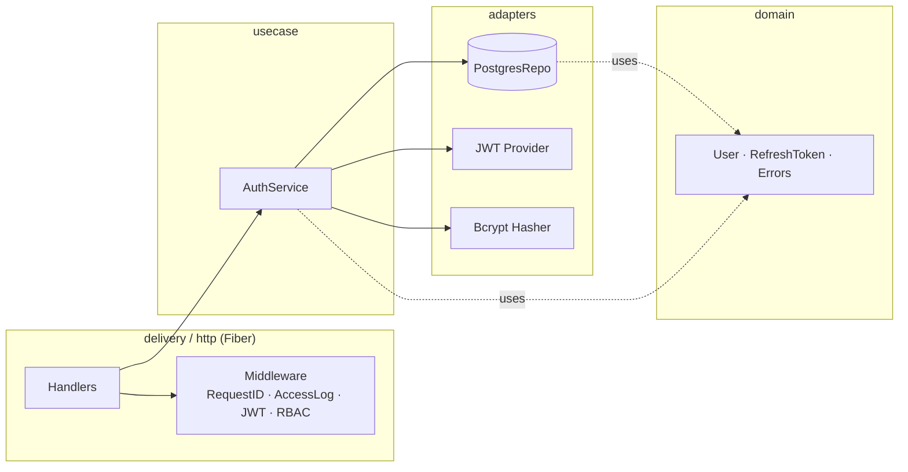

# auth-service

Сервис аутентификации и пользователей системы управления студенческими проектами.
Часть монорепозитория `student-pm` (см. корневой `README.md` и `docker-compose.yml`).

## Что внутри

- **Регистрация / логин** с bcrypt-хешированием паролей.
- **JWT** access (HS256, 15 мин) + opaque refresh-токен (32 случайных байта,
  хранится в БД как `sha256` хэш, поддерживается ротация и ревокация).
- **RBAC** на 4 роли: `student`, `group_leader`, `teacher`, `admin`.
- **Чистая архитектура** (Uncle Bob): `domain` ← `usecase` ← `repository` / `delivery`.
- **PostgreSQL** через `pgx/v5` + миграции `golang-migrate`, применяются на старте.
- **Swagger** UI на `/swagger/`.
- **Health-checks** `/health` и `/ready`.
- **Структурный лог** (zerolog) с `request_id`, проброшенным через `X-Request-ID`.
- **Graceful shutdown** по `SIGINT`/`SIGTERM`.

## Эндпоинты

| Метод  | Путь              | Auth            | Описание                              |
| ------ | ----------------- | --------------- | ------------------------------------- |
| POST   | `/auth/register`  | —               | регистрация + выдача пары токенов     |
| POST   | `/auth/login`     | —               | вход по email/паролю                  |
| POST   | `/auth/refresh`   | —               | обмен refresh на новую пару (ротация) |
| POST   | `/auth/logout`    | Bearer          | ревокация всех refresh-токенов        |
| GET    | `/users/me`       | Bearer          | текущий пользователь                  |
| GET    | `/users/:id`      | Bearer          | пользователь по UUID                  |
| PATCH  | `/users/:id`      | Bearer          | частичное обновление (RBAC внутри)    |
| GET    | `/health`         | —               | liveness                              |
| GET    | `/ready`          | —               | readiness                             |
| GET    | `/swagger/*`      | —               | Swagger UI                            |

Единый формат ошибок:

```json
{ "error": { "code": "invalid_credentials", "message": "invalid email or password" } }
```

## Архитектура



Зависимости направлены строго внутрь: `delivery` и `repository` зависят от
`usecase`, `usecase` — от `domain`, `domain` — ни от чего. Пакеты `pkg/jwt`
и `pkg/hasher` реализуют порты, объявленные в `usecase/interfaces.go`.

## Структура

```
auth-service/
├── cmd/main.go                    # DI-контейнер, миграции, graceful shutdown
├── internal/
│   ├── domain/                    # User, Role, RefreshToken, ошибки
│   ├── usecase/                   # AuthService, порты репозиториев и адаптеров
│   ├── repository/                # PostgresRepo (pgx/v5)
│   ├── delivery/http/             # handlers, middleware, routes, DTO
│   ├── config/                    # viper + godotenv
│   └── pkg/
│       ├── jwt/                   # HS256 access + opaque refresh
│       ├── hasher/                # bcrypt
│       ├── errors/                # единый формат HTTP-ошибок
│       ├── validator/             # обёртка над go-playground/validator
│       └── logger/                # zerolog factory
├── migrations/                    # 000001_init.{up,down}.sql
├── docs/                          # swagger (генерируется через `make swag`)
├── tests/
│   ├── unit/                      # тесты usecase (моки)
│   └── integration/               # in-process тест Fiber + in-memory repo
├── Dockerfile
├── Makefile
├── .air.toml
├── .env.example
└── README.md
```

## Запуск

### 1. Через docker-compose из корня монорепозитория

```bash
cp .env.example .env
docker-compose up -d auth-postgres auth-service
```

Сервис поднимется на `http://localhost:8081`, БД — на `localhost:5433`.

### 2. Локально (для отладки в VS Code)

```bash
# 1. Поднять только Postgres из корневого compose
docker-compose up -d auth-postgres

# 2. В .env прописать POSTGRES_HOST=localhost и POSTGRES_PORT=5433
cp .env.example .env

# 3. Запуск
make run     # либо `make dev` для air, либо F5 в VS Code
```

Миграции применяются автоматически на старте (`golang-migrate`).

## Команды Make

```
make help              # список целей
make run               # запуск
make dev               # hot-reload через air
make test              # все тесты
make test-unit         # только unit
make test-integration  # только integration
make cover             # покрытие usecase
make migrate-up        # применить миграции вручную
make swag              # сгенерировать docs/
make docker-build      # собрать образ
```

## Тесты

```bash
make test
make cover
# coverage:  ok   github.com/student-pm/auth-service/internal/usecase   coverage: 86.7%
```

Покрытие usecase-слоя — выше 60% (требование ТЗ): см. `tests/unit/`.

### testcontainers-go (опционально)

Для полноценного e2e с реальным Postgres вместо in-memory можно подключить
`testcontainers-go`. Заготовка — в `tests/integration/auth_flow_test.go`,
требуется только заменить `buildApp` на вариант, поднимающий контейнер
`postgres:15-alpine` и вызывающий `repository.NewPostgresRepo(pool)`.

## Безопасность — что важно

- Пароль никогда не возвращается; `User.PasswordHash` помечен `json:"-"`.
- Логин с неизвестным email → `ErrInvalidCredentials` (тот же ответ, что и при
  неверном пароле): не раскрываем существование email.
- Refresh-токены **ротируются**: на `/auth/refresh` старый токен ревокается
  и выдаётся новый. Повторное использование ранее ревокированного токена → `401`.
- В БД хранится `sha256(refresh_token)`, не сам токен.
- JWT secret валидируется при старте (минимум 16 символов).

## Замечания для проверяющего

- **Почему pgx, а не GORM.** Курсовая — про чистую архитектуру и явные
  границы; `pgx` даёт прямой контроль над SQL, без скрытой магии и
  неожиданных N+1. Для 2 таблиц с простыми запросами ORM не нужен.
- **Почему opaque refresh, а не JWT-refresh.** Чтобы можно было ревокировать
  один токен или все токены пользователя, не таская публичный JWKS и не вводя
  отдельный список «отозванных JTI».
- **Почему миграции на старте.** Удобно для курсовой и dev; в проде это
  выносится в отдельный init-контейнер или CI-шаг.
